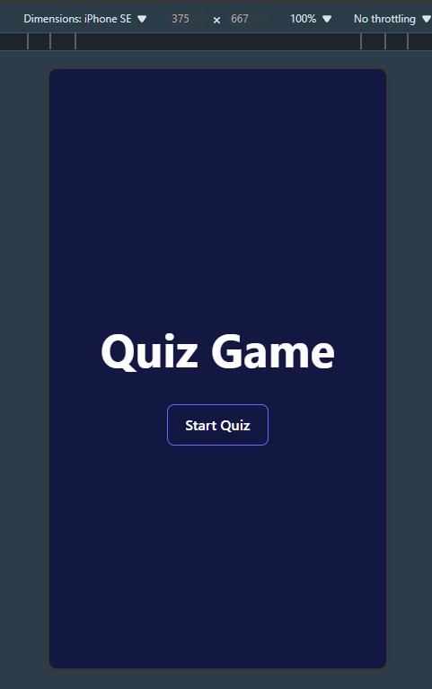
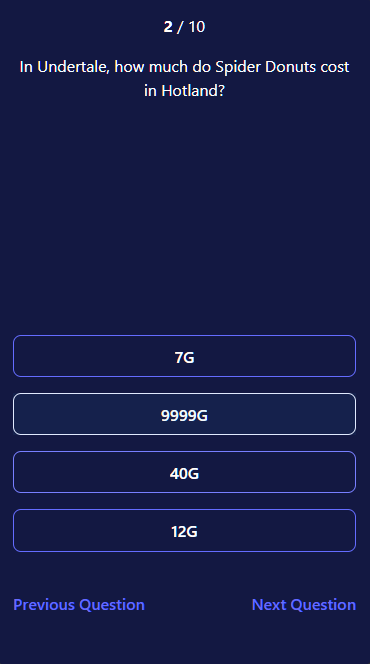
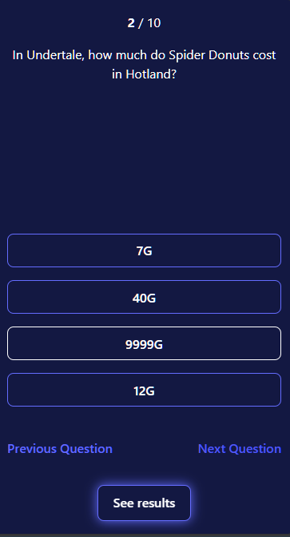
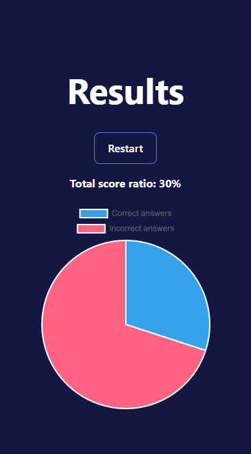
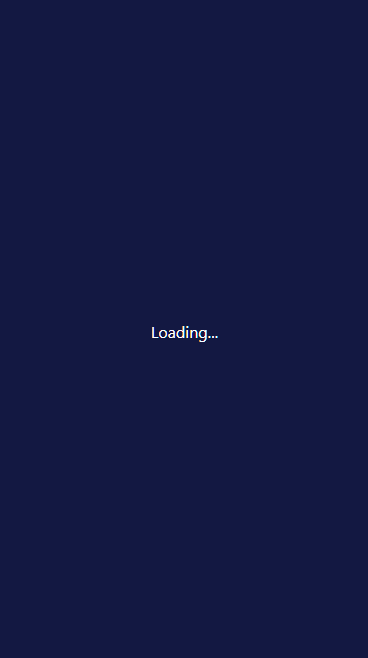
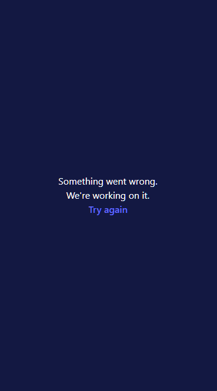

# About Project

UX:

- supports light, dark mode and rwd
- showing loading and error views during transitions between views
- showing one question on the screen
- allows to modify answered questions
- showing progress (current question/total questions)
- showing summary with chart
- allows to restart the quiz - new questions set is loaded

Technical:

- app created using required stack:
  - Vue 3 Composition API
  - TypeScript
  - Pinia
  - Vue Router
- a few example tests added using Vitest
- separate data and logic between 3 stores:
  - appStore - contains data related to the app state, e.g. `isQuizCompleted`
  - userAnswers - to store user answers
  - trivia - to store fetched trivia's API data

| view type | screenshot |
| --- | --- |
| home |  |
| quiz |  |
| quiz completed Button "See results" is visible and user still can change the questions |  |
| results |  |
| loading view |  |
| error view | 
